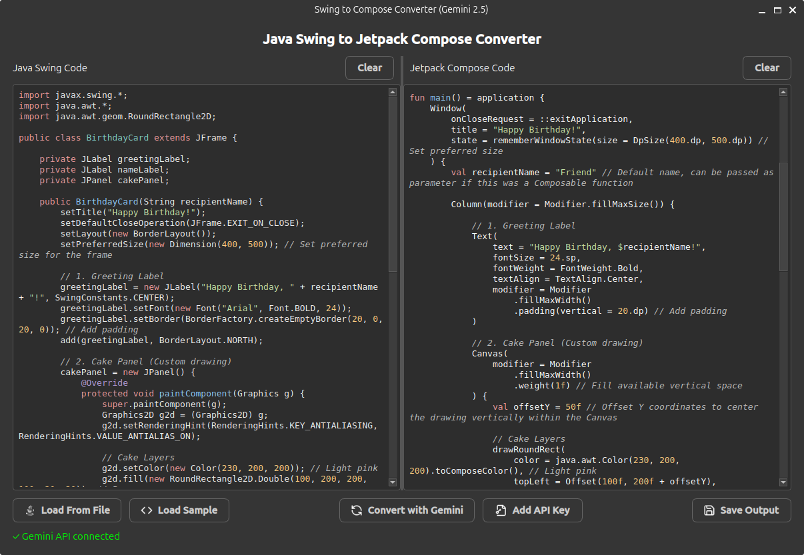

# Swing to Compose Converter

A desktop application that automatically converts Java Swing UI code to Jetpack Compose for Desktop (Kotlin) code using Google's Gemini AI.



## Features

- **Intelligent Code Conversion**: Automatically translates Java Swing components and layouts to Jetpack Compose equivalents
- **Real-time Streaming Conversion**: See the Kotlin code appear in real-time with a smooth fading animation
- **Material 3 Implementation**: The converted code uses modern Material 3 components
- **Syntax Highlighting**: Both input and output code are properly highlighted
- **Automatic Layout Conversion**: Transforms Swing layout managers to Compose layouts
- **Smart State Management**: Converts Java event listeners and variable changes to Compose state management
- **Dark Mode UI**: Clean, modern desktop UI with a dark theme
- **API Key Management**: Easily add your own Gemini API key through the interface

## Installation

### Method 1: Install from Debian Package

The easiest way to install on Debian/Ubuntu-based systems:

```bash
# Download the latest package
wget https://github.com/zahid4kh/swingtocompose/releases/download/v1.0.1/swingtocompose-1.0.1.deb

# Install the package
sudo apt install ./swingtocompose-1.0.1.deb
```

The application will be installed to `/usr/share/swingtocompose/` and will be available in your applications menu or by running `swingtocompose` in a terminal.

### Method 2: Install from Source

If you want to install from source:

```bash
# Clone the repository
git clone https://github.com/zahid4kh/swingtocompose.git
cd swingtocompose

# Create and activate a virtual environment
python3 -m venv .venv
source .venv/bin/activate

# Install dependencies
pip install -r requirements.txt

# Run the application
python3 main.py
```

## Getting a Gemini API Key

The application requires a Google Gemini API key to perform code conversions. When first launched, it will run in demo mode if no key is found.

To get your own Gemini API key:

1. Visit [Google AI Studio](https://aistudio.google.com/u/1/apikey)
2. Sign in with your Google account
3. Click "Create API Key"
4. Copy the API key

Once you have your API key:

1. Launch the Swing to Compose Converter
2. Click the "Add API Key" button
3. Paste your API key into the dialog and click OK

Your API key will be stored for future use. The application will automatically find and use the key in subsequent launches.

## Usage

1. Launch the application by running `swingtocompose` or from your applications menu
2. Paste your Java Swing code into the left panel
3. Click "Convert with Gemini" to start the conversion
4. The converted Jetpack Compose code will appear in the right panel
5. Save the output using the "Save Output" button

You can also:

- Load Java code from a file using "Load From File"
- Load a sample Swing form using "Load Sample"
- Clear the input or output panels using their respective "Clear" buttons

## Building the Debian Package

If you want to build the Debian package yourself:

```bash
# Make sure the buildpackage script is executable
chmod +x buildpackage

# Run the script
./buildpackage
```

This will create a .deb package in the current directory.

## Troubleshooting

### API Key Issues

- If your API key isn't working, verify it's still valid by testing it on the [Google AI Studio](https://aistudio.google.com/u/1/apikey) website
- Check that the application has permission to read from the directory where the .env file is stored
- You can manually create a .env file in the installation directory with `GEMINI_API_KEY=your_key_here`

### Package Removal

If you have trouble removing the package:

```bash
# Force removal of the package
sudo dpkg --force-all -r swingtocompose

# Manually clean up any remaining files if needed
sudo rm -rf /usr/share/swingtocompose
sudo rm -f /usr/bin/swingtocompose
sudo rm -f /usr/share/applications/swingtocompose.desktop
```

### Virtual Environment Issues

If the application fails to start after installation from the .deb package:

```bash
# Reinstall the Python dependencies manually
sudo /usr/share/swingtocompose/.venv/bin/pip install PyQt6 python-dotenv pygments google-genai
```
